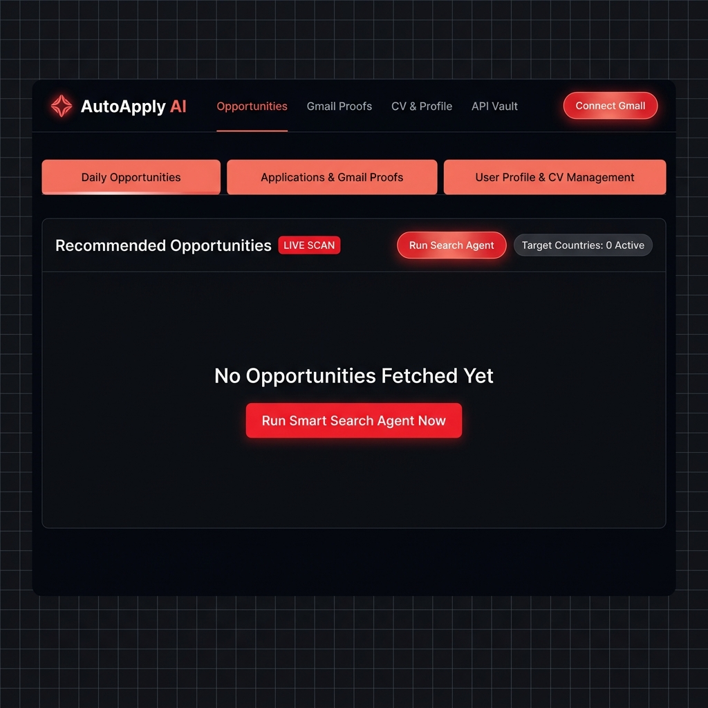

<p align="center">
  
</p>

<h1 align="center">🚀 Auto Apply AI</h1>

<p align="center">
  <b>Autonomous Multi-Agent AI Platform for PDF & DOCX Resume Parsing, Multi-Model LLM Support (Ollama/OpenAI/Gemini), RAG Semantic Matching, Multi-Country Job Scraping, and Gmail Tracking.</b>
</p>

<p align="center">
  <a href="#-key-features"></a>
  <a href="#-key-features"></a>
  <a href="#-key-features"></a>
  <a href="#-key-features"></a>
  <a href="#-key-features"></a>
  <a href="#-key-features"></a>
  <a href="#-key-features"></a>
  <a href="#-key-features"></a>
  <a href="#-license"></a>
</p>

---

<p align="center">
  
</p>

<p align="center">
  <i>🖥️ AutoApply AI — Dark Grid Interface with Coral-Red Accent Theme, Real-Time RAG Agent Thinking UI & Gmail Auto-Apply</i>
</p>

---

## 📌 Table of Contents

- [Overview](#-overview)
- [Key Features](#-key-features)
- [System Architecture](#-system-architecture)
- [Tech Stack](#-tech-stack)
- [Repository Structure](#-repository-structure)
- [Getting Started](#-getting-started)
  - [Prerequisites](#prerequisites)
  - [Backend Setup (FastAPI)](#1-backend-setup-fastapi)
  - [Frontend Setup (Next.js)](#2-frontend-setup-nextjs)
  - [Connecting Gmail Account](#3-connecting-gmail-account)
- [Environment Variables](#-environment-variables)
- [API Documentation](#-api-documentation)
- [License](#-license)

---

## 💡 Overview

**Auto Apply AI** is an end-to-end, multi-agent AI platform designed to completely automate and optimize the modern job hunting process.

Instead of manually editing CVs, searching across multiple job portals, and writing repetitive emails, **Auto Apply AI** provides:
1. **PDF & DOCX AI Resume Parsing**: Reads both PDF and Word (`.docx`) files natively to extract executive summary, work experience, education, and tech skills.
2. **Real-Time RAG Agent Thinking UI**: Interactive terminal-style progress log displaying real-time RAG context chunking, skill extraction, and ATS match scoring.
3. **Multi-Model LLM Vault (Free & Paid)**: Native support for 100% Free Local Offline LLMs (Ollama / LM Studio), Groq, OpenRouter, Google Gemini, DeepSeek, and OpenAI.
4. **Interactive Target Country Selection (1-10 Countries)**: Filter jobs by up to 10 destination countries simultaneously (e.g. 🇺🇸 US, 🇨🇦 Canada, 🇬🇧 UK, 🇩🇪 Germany, 🇦🇪 UAE).
5. **Direct Gmail Auto-Apply & Tracking**: Delivers custom cover letters and candidate CVs directly to company hiring emails with message IDs tracked in the candidate's Gmail "Sent" folder.

---

## 🔥 Key Features

### 📄 1. PDF & Word (`.docx`) Resume Parsing Engine
- **Multi-Format Extraction**: Parses both `.pdf` and Word `.docx` documents natively without external C library dependencies.
- **RAG Profile Breakdown**: Extracts structured executive summaries, skills, work experience entries, and education details.
- **Automated Fallback**: Gracefully switches to rule-based tech stack parsing if an external LLM key is unconfigured or out of quota.

### 🧠 2. Real-Time RAG Agent Thinking UI
- **Live Visual Log Window**: Watch the AI agent initialize context windows, chunk text, extract competencies, and score ATS metrics in real-time.
- **Glowing UI Box**: Replaces the upload area with a dynamic progress bar and animated agent status indicators.

### 🌐 3. Interactive Multi-Country Autocomplete Search (1-10 Countries)
- **Autocomplete Dropdown**: Search and select target destination countries with dynamic tag badges (`✓ Country ✕`).
- **Target Preferences**: Set remote work preferences (`Fully Remote`, `Hybrid`, `On-site`), USD salary bands, and experience tiers.

### 🔑 4. Multi-LLM Provider & API Keys Vault
- **Free Local LLMs**: Built-in support for Ollama / LM Studio running 100% offline and free at `http://localhost:11434/v1`.
- **Cloud LLM Providers**: Support for OpenAI, Groq, DeepSeek, OpenRouter, and Google Gemini.
- **Secure Key Masking**: All stored secret keys are securely masked in the UI.

### 📧 5. Gmail Proofs & History Hub (Today / Monthly / Yearly)
- **Flexible Connection**: Connect via Google OAuth2 or 16-character Gmail App Password (SMTP).
- **Time-Period Filters**: Track application deliveries by **Today** (24 Hours), **Monthly**, **Yearly**, or **All**.
- **Sent Folder Proofs**: Every application email appears directly in the candidate's official Gmail "Sent" folder.

---

## 🏗️ System Architecture

```mermaid
graph TD
    User([Candidate / User]) <--> Dashboard[Next.js 16 + Tailwind Dashboard]
    Dashboard <--> REST[FastAPI REST API Server]
    
    subgraph Core Storage & Data Layer
        REST <--> SQLite[(SQLite / PostgreSQL\nLocal DB)]
        REST <--> VectorDB[(ChromaDB\nVector Embeddings)]
    end

    subgraph Multi-Agent Processing Engine
        REST <--> ResumeAgent[Resume & ATS Parser]
        REST <--> SearchAgent[Multi-Country Search Aggregator]
        REST <--> MatchAgent[RAG Semantic Matcher]
        REST <--> EmailAgent[Gmail & Email Tracking Engine]
    end

    subgraph External LLM & Service Providers
        ResumeAgent --> LocalLLM[Ollama / LM Studio\n(100% Free Offline)]
        ResumeAgent --> CloudLLMs[OpenAI / Gemini / Groq / DeepSeek]
        EmailAgent --> Gmail[Gmail API / SMTP Client]
        SearchAgent --> JobAPIs[Adzuna / Jooble / Multi-Country Scrapers]
    end
```

---

## 🛠️ Tech Stack

| Domain | Technology | Description |
| :--- | :--- | :--- |
| **Frontend Framework** | Next.js 16 (App Router) | React 19, TypeScript, Client State Management |
| **Styling** | Tailwind CSS v4 | Dark-grid theme with coral-red glow accents |
| **Backend Framework** | FastAPI | Asynchronous Python 3.12+ REST API |
| **Database** | SQLite / PostgreSQL | Automatic schema synchronization via SQLAlchemy 2.0 |
| **Vector DB** | ChromaDB | Local vector store for candidate CV embeddings |
| **Resume Parser** | PyPDF2, pdfplumber, ElementTree | PDF & DOCX native text extraction |
| **LLM Integrations** | Ollama, Groq, OpenAI, Gemini | Multi-provider AI text analysis |
| **Email Service** | Gmail API & SMTP | Direct email delivery with message ID tracking |

---

## 📁 Repository Structure

```
Auto-Apply-AI/
├── backend/                        # FastAPI Backend Application
│   ├── src/
│   │   └── app/
│   │       ├── api/                # API Route Handlers
│   │       │   ├── applications.py # Application tracking endpoints
│   │       │   ├── emails.py       # Email endpoints
│   │       │   ├── gmail.py        # Gmail OAuth & SMTP authentication
│   │       │   ├── matching.py     # RAG matching & compatibility scores
│   │       │   ├── resumes.py      # Resume parsing & ATS endpoints
│   │       │   ├── search.py       # Multi-country search endpoints
│   │       │   └── users.py        # User profile & settings management
│   │       ├── services/           # Core Business Logic & Agents
│   │       │   ├── ats_checker.py  # ATS grading & rule-based fallbacks
│   │       │   ├── pdf_parser.py   # PDF & DOCX native text extraction
│   │       │   ├── rag_service.py  # Vector search & RAG retriever
│   │       │   └── search/         # Multi-country search aggregator
│   │       ├── database.py         # SQLAlchemy engine & SQLite auto-sync
│   │       ├── main.py             # FastAPI entry point & CORS
│   │       └── models.py           # Database Schemas
│   ├── requirements.txt            # Python dependencies
│   └── pyproject.toml              # Backend project configuration
├── frontend/                       # Next.js Frontend Application
│   ├── src/
│   │   └── app/
│   │       ├── page.tsx            # Unified Dashboard & Agent Thinking UI
│   │       ├── layout.tsx          # Root Layout & Theme Providers
│   │       └── globals.css         # Tailwind CSS styles & animations
│   └── package.json                # Node.js dependencies
└── README.md                       # Project Documentation
```

---

## ⚡ Getting Started

### Prerequisites

- **Python**: v3.10 or higher
- **Node.js**: v18.x or higher
- **Git**

---

### 1. Backend Setup (FastAPI)

1. Navigate to the `backend` directory:
   ```bash
   cd backend
   ```

2. Create and activate a virtual environment:
   ```bash
   python -m venv venv
   # On Windows (PowerShell):
   .\venv\Scripts\Activate.ps1
   # On Linux/macOS:
   source venv/bin/activate
   ```

3. Install dependencies:
   ```bash
   pip install -r requirements.txt
   ```

4. Start the FastAPI server:
   ```bash
   python -m uvicorn src.app.main:app --reload --port 8000
   ```
   The backend API will run at **`http://localhost:8000`** (API documentation available at `http://localhost:8000/docs`).

---

### 2. Frontend Setup (Next.js)

1. Open a second terminal and navigate to `frontend`:
   ```bash
   cd frontend
   ```

2. Install dependencies:
   ```bash
   npm install
   ```

3. Start the Next.js development server:
   ```bash
   npm run dev
   ```
   Access the dashboard in your browser at **`http://localhost:3000`**.

---

### 3. Connecting Gmail Account

To let the AI Agent send job applications directly from your email:
1. In the dashboard top navigation bar, click **`🔑 API Vault`** or open the **Settings** tab.
2. Under **Connected Gmail Account**, select **Gmail App Password (SMTP)**.
3. Enter your Gmail address and a **16-character App Password** (generated via *Google Account > Security > 2-Step Verification > App Passwords*).
4. Click **Connect via App Password**. All sent application emails will now appear directly in your official **Gmail "Sent"** folder!

---

## 🔑 Environment Variables

### Backend (`backend/.env`)

```env
# Database Settings (Defaults to local SQLite auto_apply_local.db if empty)
DATABASE_URL=sqlite:///./auto_apply_local.db

# AI Models & LLM Setup (Optional: Leave empty if using local Ollama)
OPENAI_API_KEY=your_openai_api_key_here
LLM_PROVIDER=openai
LLM_MODEL=gpt-4o-mini

# Gmail OAuth Setup (Optional)
GMAIL_CLIENT_ID=your_google_client_id
GMAIL_CLIENT_SECRET=your_google_client_secret

# Security Secret Key
SECRET_KEY=super_secret_jwt_key_change_in_production
```

---

## 📡 API Documentation

Interactive Swagger documentation is automatically generated at `http://localhost:8000/docs`.

| Endpoint | Method | Description |
| :--- | :--- | :--- |
| `/api/v1/resumes/upload` | `POST` | Upload PDF or DOCX resume file, extract text, run ATS check & save profile |
| `/api/v1/resumes/profile` | `GET` | Retrieve stored candidate profile, summary, experience, & ATS metrics |
| `/api/v1/search/trigger` | `POST` | Run multi-country opportunity search scan |
| `/api/v1/search/opportunities`| `GET` | Fetch aggregated job and internship opportunities |
| `/api/v1/users/settings` | `GET` / `PUT` | Manage API keys, LLM providers, and target preferences |
| `/api/v1/applications` | `GET` / `POST` | Track and log submitted job application proofs |

---

## 📄 License

Distributed under the MIT License. See `LICENSE` for more information.

<p align="center">
  Crafted with ❤️ by <b>Nouman Sajid</b> for <b>Auto Apply AI</b>
</p>
