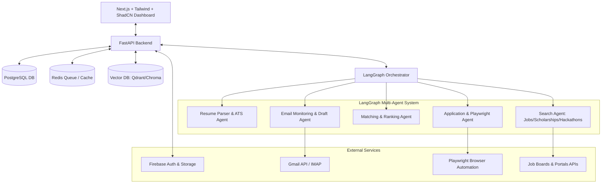

# Implementation Plan - Auto Apply AI (Phase-by-Phase Roadmap)

This document outlines a phased engineering roadmap to build **Auto Apply AI**, a fully automated multi-agent system that parses resumes, searches for jobs/internships/scholarships/hackathons, evaluates compatibility, automatically applies via browser automation/APIs, and manages notifications/follow-up email drafts.

We will break the development into 10 structured, independent milestones. We will only execute milestones as approved by the user.

---

## Technical Stack & Architecture

---

## 10-Step Implementation Roadmap

### Step 1: Project Initialization & Directory Structure
Set up the monorepo structure, initializing the FastAPI backend, Next.js frontend, and standard environment/configuration structures.
*   **Backend setup**: Poetry or Pipenv with `fastapi`, `uvicorn`, `pydantic`.
*   **Frontend setup**: Next.js with React, Tailwind CSS, and Lucide React icons.
*   **Config**: Shared `.env.example` templates, Docker Compose files for PostgreSQL, Redis, and Vector DB.

### Step 2: Database Schema Design & Migrations (PostgreSQL + Firestore + Vector DB)
Define structured relational schemas for application tracking, settings, and logs, alongside vector configurations for semantic matching.
*   **PostgreSQL (SQLAlchemy/Alembic)**: Schemas for `users`, `profiles`, `applications` (Google, Microsoft, etc., with status logs), `jobs_found`, `custom_cover_letters`, `email_interactions`.
*   **Vector DB (Chroma/Qdrant)**: Setup collection schemas for embedding resume chunks and job descriptions.
*   **Firestore & Storage**: Models for real-time notifications and PDF resume file storage configurations.

### Step 3: Authentication & File Storage (Firebase Integration)
Implement secure authentication and user asset uploads.
*   **Authentication**: Firebase Admin SDK integration in FastAPI to verify JWT tokens issued by Next.js Firebase Auth.
*   **Storage**: Firebase Storage (or local S3-compatible service for development) to upload and retrieve resume PDFs and certificates.

### Step 4: Resume Agent (PDF Parsing, Embeddings & ATS Analysis)

Build the ingestion pipeline that parses uploaded PDFs and translates them into structured JSON profiles and embeddings.

---

## User Review Required

> [!IMPORTANT]
> **LLM API Requirements**: This step introduces LLM integration for structuring resumes and grading them for ATS. We will configure it to use OpenAI's API. If no `OPENAI_API_KEY` is provided in `.env`, the system will automatically fall back to a rule-based parser and grading system so that the backend remains fully functional and testable without keys.

> [!NOTE]
> **Embeddings Storage**: We will generate embeddings using the local `SentenceTransformer` model `"all-MiniLM-L6-v2"` (from the `sentence-transformers` package already in `pyproject.toml`) and store them in ChromaDB.

---

## Open Questions

> [!NOTE]
> **Q1: Which LLM provider is preferred?**
> We propose OpenAI (`gpt-4o-mini` or `gpt-4o`) as it has robust support for structured output via Pydantic schemas. If you prefer Gemini or another provider, please let us know.
>
> **Q2: Resume Parsing Automation Trigger**
> Should uploading a resume automatically trigger parsing, ATS checks, and indexing in one synchronous step, or should the upload just save the file, leaving the client to trigger parsing explicitly? We propose automatically parsing on upload so the user profile is instantly populated.

---

## Proposed Changes

### Configuration Updates

#### [MODIFY] [config.py](file:///c:/Users/Personal/OneDrive/Desktop/Auto-Apply-AI/backend/src/app/config.py)
* Add `OPENAI_API_KEY`, `OPENAI_MODEL` (default: `"gpt-4o-mini"`), and `EMBEDDING_MODEL` (default: `"all-MiniLM-L6-v2"`) configuration settings.

---

### Resume Agent Services

#### [NEW] [pdf_parser.py](file:///c:/Users/Personal/OneDrive/Desktop/Auto-Apply-AI/backend/src/app/services/pdf_parser.py)
* Implement `extract_text_from_pdf(pdf_bytes: bytes) -> str` using `pdfplumber` with a robust fallback to `PyPDF2` in case of decoding errors.

#### [NEW] [resume_parser.py](file:///c:/Users/Personal/OneDrive/Desktop/Auto-Apply-AI/backend/src/app/services/resume_parser.py)
* Implement `parse_resume_text(text: str) -> dict` returning:
  * `skills` (list of strings)
  * `experience` (list of dicts containing `title`, `company`, `duration`, `description`)
  * `education` (list of dicts containing `degree`, `institution`, `year`)
  * `projects` (list of dicts containing `title`, `description`)
  * `languages` (list of strings)
* Integrate with OpenAI's structured outputs (`beta.chat.completions.parse`) using Pydantic schemas if `OPENAI_API_KEY` is set.
* Implement a robust rule-based regex fallback parser if `OPENAI_API_KEY` is not provided.

#### [NEW] [ats_checker.py](file:///c:/Users/Personal/OneDrive/Desktop/Auto-Apply-AI/backend/src/app/services/ats_checker.py)
* Implement `evaluate_resume_ats(profile_data: dict, target_role: str = None) -> dict` returning:
  * `ats_score` (integer 0-100)
  * `ats_suggestions` (dict with lists of `missing_skills`, `formatting_suggestions`, `experience_improvements`)
* Use LLM matching if `OPENAI_API_KEY` is set, otherwise run a fallback rule-based similarity and keyword density check.

#### [NEW] [embeddings.py](file:///c:/Users/Personal/OneDrive/Desktop/Auto-Apply-AI/backend/src/app/services/embeddings.py)
* Implement `generate_and_store_resume_embeddings(user_id: str, profile_data: dict)`:
  * Use local `SentenceTransformer` to encode resume components (skills, work history descriptions, projects).
  * Store and index the vectors in ChromaDB linked to the `user_id`.

---

### API Endpoint Integration

#### [MODIFY] [users.py](file:///c:/Users/Personal/OneDrive/Desktop/Auto-Apply-AI/backend/src/app/api/users.py)
* Update `upload_resume` endpoint to automatically trigger the parsing, ATS scoring, and embedding generation pipeline upon successful upload, updating the user's `Profile` table record.

#### [NEW] [resumes.py](file:///c:/Users/Personal/OneDrive/Desktop/Auto-Apply-AI/backend/src/app/api/resumes.py)
* Add endpoints:
  * `GET /api/v1/resumes/profile` to retrieve parsed resume profile data, ATS score, and suggestions.
  * `POST /api/v1/resumes/ats-check` to re-score the parsed resume against a user-specified job description or title.

#### [MODIFY] [main.py](file:///c:/Users/Personal/OneDrive/Desktop/Auto-Apply-AI/backend/src/app/main.py)
* Register the new `resumes` router.

---

## Verification Plan

### Automated Tests
* Create `backend/tests/test_resume_agent.py` to verify:
  1. PDF text extraction from a sample PDF bytes structure.
  2. Rule-based resume parser fallback correctness.
  3. ATS scoring logic and response structure.
  4. Embedding generation and storage in ChromaDB client.
* Run tests with: `poetry run pytest backend/tests/test_resume_agent.py` or `pytest backend/tests/test_resume_agent.py`.

### Manual Verification
* Upload a sample resume PDF using Postman / Swagger UI.
* Retrieve the parsed profile details via `/api/v1/resumes/profile` and verify JSON keys contain structured data.
* Run an ATS check against a specific job role (e.g. "Python Developer") and verify the suggestions and score output.

### Step 5: Search Agent (APIs, Scraping & Aggregator Pipeline)
Create a scheduled engine that regularly queries open APIs and scrapes job/scholarship listings.
*   **APIs**: Integrations with Adzuna, Jooble, and scraping scripts for Google Careers, Greenhouse, Lever, Ashby.
*   **Scholarship/Hackathons Crawlers**: RSS feeds and web scraper modules targeting top scholarship and hackathon lists.
*   **Scheduler**: APScheduler or Celery Beat worker executing hourly.

### Step 6: Matching Agent (Semantic Matching & Score Thresholding)
Build the decision-making engine that compares extracted candidate profiles against incoming jobs/opportunities.
*   **Vector Search**: Semantic similarity queries between job descriptions and resume profiles.
*   **Constraint Checking**: Hard filtering on preferred countries, salary range, remote vs. onsite, visa sponsorship, and daily apply limits.
*   **Ranking logic**: Output matching percentage (e.g. 92%) and queue for auto-applying if above a threshold (e.g., >80%).

### Step 7: Application Agent (Playwright Browser Automation & Cover Letter Generator)
Implement the core automation that fills out forms and uploads candidate materials.
*   **Playwright Engine**: Scripts to log in, navigate, and dynamically fill out standard application forms (Name, Email, Phone, LinkedIn, GitHub, Resume upload, Custom questions).
*   **Cover Letter Generator**: Dynamic prompt engine to generate context-aware, hyper-tailored cover letters for the specific job description and company.
*   **Status Reporter**: Save screenshot artifacts and update application state in DB.

### Step 8: Email Agent (Inbox Monitoring & Automatic Drafting)
Automate check-ins on applicant mailboxes to capture interviewer responses or requests.
*   **Gmail Integration**: IMAP / Gmail API listener to watch for replies from applied domains.
*   **Classification Engine**: LLM classification of incoming emails (e.g., Interview Invite, Rejection, Action Required: Transcript/References).
*   **Draft Writer**: Automatically draft responses (e.g. providing references, confirming time slots) and notify the user via DB/Dashboard.

### Step 9: User Dashboard (Next.js Frontend)
Construct a premium, dark-themed responsive dashboard for checking stats and logs.
*   **Views**: Home (daily target progress bar, status metrics), Applications list, Statistics (Acceptance rate, Interview vs Rejected chart), AI Suggestions page, Notifications panel.
*   **Real-time updates**: Setup WebSocket or polling to fetch application logs.

### Step 10: System Integration, Notification Agents & End-to-End Testing
Add real-time push alerts and verify the system works under high concurrency.
*   **Notification Agent**: Integrations with Discord Webhooks / Telegram Bot API / Firebase Cloud Messaging.
*   **End-to-End Validation**: Mock job portals testing complete cycle (Resume Upload -> Match -> Generate Assets -> Playwright Apply -> Status Updated).

---

## Verification Plan

### Automated Tests
*   `pytest tests/test_resume_parser.py`: Verify parsing correctness on sample resumes.
*   `pytest tests/test_match_agent.py`: Confirm matching thresholds filter jobs correctly.
*   `pytest tests/test_playwright_forms.py`: Run local mock-server application forms to ensure Playwright reliably fills out details.

### Manual Verification
*   Visual inspection of parsed profiles on Dashboard UI.
*   Review generated cover letters for quality.
*   Check email draft folder for correctly formatted responses.
