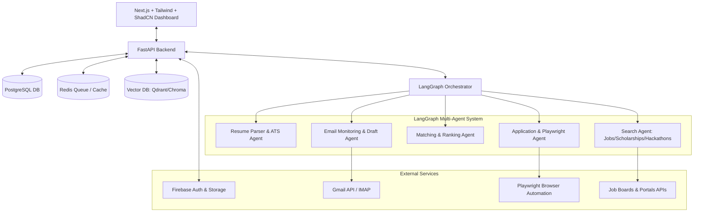

# Implementation Plan - Auto Apply AI (Phase-by-Phase Roadmap)

This document outlines a phased engineering roadmap to build **Auto Apply AI**, a fully automated multi-agent system that parses resumes, searches for jobs/internships/scholarships/hackathons, evaluates compatibility, automatically applies via browser automation/APIs, and manages notifications/follow-up email drafts.

We will break the development into 10 structured, independent milestones. We will only execute milestones as approved by the user.

---

## Technical Stack & Architecture

---

## 10-Step Implementation Roadmap

### Step 1: Project Initialization & Directory Structure
Set up the monorepo structure, initializing the FastAPI backend, Next.js frontend, and standard environment/configuration structures.
*   **Backend setup**: Poetry or Pipenv with `fastapi`, `uvicorn`, `pydantic`.
*   **Frontend setup**: Next.js with React, Tailwind CSS, and Lucide React icons.
*   **Config**: Shared `.env.example` templates, Docker Compose files for PostgreSQL, Redis, and Vector DB.

### Step 2: Database Schema Design & Migrations (PostgreSQL + Firestore + Vector DB)
Define structured relational schemas for application tracking, settings, and logs, alongside vector configurations for semantic matching.
*   **PostgreSQL (SQLAlchemy/Alembic)**: Schemas for `users`, `profiles`, `applications` (Google, Microsoft, etc., with status logs), `jobs_found`, `custom_cover_letters`, `email_interactions`.
*   **Vector DB (Chroma/Qdrant)**: Setup collection schemas for embedding resume chunks and job descriptions.
*   **Firestore & Storage**: Models for real-time notifications and PDF resume file storage configurations.

### Step 3: Authentication & File Storage (Firebase Integration)
Implement secure authentication and user asset uploads.
*   **Authentication**: Firebase Admin SDK integration in FastAPI to verify JWT tokens issued by Next.js Firebase Auth.
*   **Storage**: Firebase Storage (or local S3-compatible service for development) to upload and retrieve resume PDFs and certificates.

### Step 4: Resume Agent (PDF Parsing, Embeddings & ATS Analysis)

Build the ingestion pipeline that parses uploaded PDFs and translates them into structured JSON profiles and embeddings.

---

## User Review Required

> [!IMPORTANT]
> **LLM API Requirements**: This step introduces LLM integration for structuring resumes and grading them for ATS. We will configure it to use OpenAI's API. If no `OPENAI_API_KEY` is provided in `.env`, the system will automatically fall back to a rule-based parser and grading system so that the backend remains fully functional and testable without keys.

> [!NOTE]
> **Embeddings Storage**: We will generate embeddings using the local `SentenceTransformer` model `"all-MiniLM-L6-v2"` (from the `sentence-transformers` package already in `pyproject.toml`) and store them in ChromaDB.

---

## Open Questions

> [!NOTE]
> **Q1: Which LLM provider is preferred?**
> We propose OpenAI (`gpt-4o-mini` or `gpt-4o`) as it has robust support for structured output via Pydantic schemas. If you prefer Gemini or another provider, please let us know.
>
> **Q2: Resume Parsing Automation Trigger**
> Should uploading a resume automatically trigger parsing, ATS checks, and indexing in one synchronous step, or should the upload just save the file, leaving the client to trigger parsing explicitly? We propose automatically parsing on upload so the user profile is instantly populated.

---

## Proposed Changes

### Configuration Updates

#### [MODIFY] [config.py](file:///c:/Users/Personal/OneDrive/Desktop/Auto-Apply-AI/backend/src/app/config.py)
* Add `OPENAI_API_KEY`, `OPENAI_MODEL` (default: `"gpt-4o-mini"`), and `EMBEDDING_MODEL` (default: `"all-MiniLM-L6-v2"`) configuration settings.

---

### Resume Agent Services

#### [NEW] [pdf_parser.py](file:///c:/Users/Personal/OneDrive/Desktop/Auto-Apply-AI/backend/src/app/services/pdf_parser.py)
* Implement `extract_text_from_pdf(pdf_bytes: bytes) -> str` using `pdfplumber` with a robust fallback to `PyPDF2` in case of decoding errors.

#### [NEW] [resume_parser.py](file:///c:/Users/Personal/OneDrive/Desktop/Auto-Apply-AI/backend/src/app/services/resume_parser.py)
* Implement `parse_resume_text(text: str) -> dict` returning:
  * `skills` (list of strings)
  * `experience` (list of dicts containing `title`, `company`, `duration`, `description`)
  * `education` (list of dicts containing `degree`, `institution`, `year`)
  * `projects` (list of dicts containing `title`, `description`)
  * `languages` (list of strings)
* Integrate with OpenAI's structured outputs (`beta.chat.completions.parse`) using Pydantic schemas if `OPENAI_API_KEY` is set.
* Implement a robust rule-based regex fallback parser if `OPENAI_API_KEY` is not provided.

#### [NEW] [ats_checker.py](file:///c:/Users/Personal/OneDrive/Desktop/Auto-Apply-AI/backend/src/app/services/ats_checker.py)
* Implement `evaluate_resume_ats(profile_data: dict, target_role: str = None) -> dict` returning:
  * `ats_score` (integer 0-100)
  * `ats_suggestions` (dict with lists of `missing_skills`, `formatting_suggestions`, `experience_improvements`)
* Use LLM matching if `OPENAI_API_KEY` is set, otherwise run a fallback rule-based similarity and keyword density check.

#### [NEW] [embeddings.py](file:///c:/Users/Personal/OneDrive/Desktop/Auto-Apply-AI/backend/src/app/services/embeddings.py)
* Implement `generate_and_store_resume_embeddings(user_id: str, profile_data: dict)`:
  * Use local `SentenceTransformer` to encode resume components (skills, work history descriptions, projects).
  * Store and index the vectors in ChromaDB linked to the `user_id`.

---

### API Endpoint Integration

#### [MODIFY] [users.py](file:///c:/Users/Personal/OneDrive/Desktop/Auto-Apply-AI/backend/src/app/api/users.py)
* Update `upload_resume` endpoint to automatically trigger the parsing, ATS scoring, and embedding generation pipeline upon successful upload, updating the user's `Profile` table record.

#### [NEW] [resumes.py](file:///c:/Users/Personal/OneDrive/Desktop/Auto-Apply-AI/backend/src/app/api/resumes.py)
* Add endpoints:
  * `GET /api/v1/resumes/profile` to retrieve parsed resume profile data, ATS score, and suggestions.
  * `POST /api/v1/resumes/ats-check` to re-score the parsed resume against a user-specified job description or title.

#### [MODIFY] [main.py](file:///c:/Users/Personal/OneDrive/Desktop/Auto-Apply-AI/backend/src/app/main.py)
* Register the new `resumes` router.

---

## Verification Plan

### Automated Tests
* Create `backend/tests/test_resume_agent.py` to verify:
  1. PDF text extraction from a sample PDF bytes structure.
  2. Rule-based resume parser fallback correctness.
  3. ATS scoring logic and response structure.
  4. Embedding generation and storage in ChromaDB client.
* Run tests with: `poetry run pytest backend/tests/test_resume_agent.py` or `pytest backend/tests/test_resume_agent.py`.

### Manual Verification
* Upload a sample resume PDF using Postman / Swagger UI.
* Retrieve the parsed profile details via `/api/v1/resumes/profile` and verify JSON keys contain structured data.
* Run an ATS check against a specific job role (e.g. "Python Developer") and verify the suggestions and score output.

### Step 5: Search Agent (APIs, Scraping & Aggregator Pipeline)

Create a scheduled engine that regularly queries open APIs and scrapes job/scholarship listings.

---

## User Review Required

> [!IMPORTANT]
> **API Keys Requirement**: Integrations with Adzuna and Jooble require credentials. We will add configuration placeholders in `config.py` and `.env`. If no API keys are provided, the search providers will return verified mock opportunities (e.g. standard developer openings) to ensure local tests and system runs remain fully functional and unblocked.

> [!NOTE]
> **Scraping Framework**: For Lever, Greenhouse, and Ashby boards, we will query their public JSON endpoints (APIs) instead of raw HTML scraping. This is much faster, more robust, and doesn't break due to layout changes.
> For Google Careers and standard RSS boards, we will use a resilient HTTP client parsing RSS XML feed structures.

---

## Open Questions

> [!NOTE]
> **Q1: What companies should we index by default?**
> We propose seeding default tracked companies for Greenhouse/Lever/Ashby (e.g., Stripe, Vercel, OpenAI, Cloudflare). If you want specific companies, they can be configured via settings.
>
> **Q2: Background Scheduler Implementation**
> Instead of bringing in a heavy Celery setup, we propose using a Python `asyncio` background loop triggered on FastAPI startup (resilient background task). Alternatively, we can integrate `APScheduler` or write an admin trigger endpoint. We propose providing *both* a startup loop (running hourly) and an admin trigger API endpoint `/api/v1/search/trigger` for manual executions.

---

## Proposed Changes

### Configuration Updates

#### [MODIFY] [config.py](file:///c:/Users/Personal/OneDrive/Desktop/Auto-Apply-AI/backend/src/app/config.py)
* Add settings for `ADZUNA_APP_ID`, `ADZUNA_APP_KEY`, `JOOBLE_API_KEY`.
* Add list of default seed companies for board scraping (`TRACKED_COMPANIES_GREENHOUSE`, `TRACKED_COMPANIES_LEVER`).
* Add search schedule intervals.

---

### Search Agent Providers

#### [NEW] [base.py](file:///c:/Users/Personal/OneDrive/Desktop/Auto-Apply-AI/backend/src/app/services/search/base.py)
* Define `BaseSearchProvider` abstract class with:
  * `async def search(self, query: str, country: str = "us") -> List[dict]`

#### [NEW] [adzuna.py](file:///c:/Users/Personal/OneDrive/Desktop/Auto-Apply-AI/backend/src/app/services/search/adzuna.py)
* Implement `AdzunaProvider`: Query Adzuna API for jobs. Return mock jobs if credentials are empty.

#### [NEW] [jooble.py](file:///c:/Users/Personal/OneDrive/Desktop/Auto-Apply-AI/backend/src/app/services/search/jooble.py)
* Implement `JoobleProvider`: Query Jooble API for jobs. Return mock jobs if credentials are empty.

#### [NEW] [boards.py](file:///c:/Users/Personal/OneDrive/Desktop/Auto-Apply-AI/backend/src/app/services/search/boards.py)
* Implement `GreenhouseProvider` and `LeverProvider` to fetch open listings for our default tracked companies via public endpoints.

#### [NEW] [rss.py](file:///c:/Users/Personal/OneDrive/Desktop/Auto-Apply-AI/backend/src/app/services/search/rss.py)
* Implement `RSSProvider` to parse opportunities from hackathon and scholarship feeds (e.g. Devpost RSS or similar public boards).

---

### Aggregator & Database Integration

#### [NEW] [aggregator.py](file:///c:/Users/Personal/OneDrive/Desktop/Auto-Apply-AI/backend/src/app/services/search/aggregator.py)
* Implement `SearchAggregator`:
  * Runs all active providers concurrently.
  * Filters and cleans results (formatting fields, standardizing types).
  * Performs duplicate checks against the `jobs_found` database table (using URL matching).
  * Saves new, unique job opportunities to PostgreSQL.

#### [NEW] [scheduler.py](file:///c:/Users/Personal/OneDrive/Desktop/Auto-Apply-AI/backend/src/app/services/search/scheduler.py)
* Setup a background daemon loop running on FastAPI startup to execute the search aggregation every 6 hours.

---

### API Router Integration

#### [NEW] [search.py](file:///c:/Users/Personal/OneDrive/Desktop/Auto-Apply-AI/backend/src/app/api/search.py)
* Add endpoints:
  * `POST /api/v1/search/trigger` to manually execute a crawl & aggregate cycle (accepts custom query e.g. "React Developer").
  * `GET /api/v1/search/opportunities` to fetch the list of discovered jobs from the `jobs_found` database (supporting pagination and filtering).

#### [MODIFY] [main.py](file:///c:/Users/Personal/OneDrive/Desktop/Auto-Apply-AI/backend/src/app/main.py)
* Register the new `/api/v1/search` routes.
* Wire up the startup/shutdown events to trigger/close the background scheduler loop.

---

## Verification Plan

### Automated Tests
* Create `backend/tests/test_search_agent.py` verifying:
  1. Adzuna & Jooble fallback mocks return standard structured schemas.
  2. RSS feed parser successfully parses sample XML content.
  3. Greenhouse/Lever URL crawlers fetch and format correctly.
  4. SearchAggregator deduplicates and inserts new entries into DB.
* Run tests with: `poetry run python -m unittest tests/test_search_agent.py`.

### Manual Verification
* Trigger aggregation using Swagger UI endpoint `/api/v1/search/trigger` with a query like "Python".
* Inspect the database table `jobs_found` to confirm records are added.
* Fetch opportunities via `/api/v1/search/opportunities` and verify pagination and query parameters.

### Step 6: Matching Agent (Semantic Matching & Score Thresholding)

Build the decision-making engine that compares extracted candidate profiles against incoming jobs/opportunities.

---

## User Review Required

> [!IMPORTANT]
> **Matching Algorithm & Weights**: We propose a composite matching score combining:
> * **Vector Search Similarity (60% weight)**: Compares job description embeddings against the candidate's resume embeddings stored in ChromaDB.
> * **Heuristic Keyword Density (40% weight)**: Compares required job keywords directly against user's skills.
> If the combined score is above the user-defined threshold (default: 80%), the opportunity is queued in the `applications` table with a state of `"Matched / Ready to Apply"` (or `"Resume Required"` if custom files are needed).

> [!NOTE]
> **Hard Constraints Rules**: If any of the user's hard constraints (e.g. Visa sponsorship required but not offered, salary maximum below `min_salary`, or disallowed country) are violated, the match is discarded immediately (score set to 0) to avoid applying to unqualified positions.

---

## Open Questions

> [!NOTE]
> **Q1: Do we auto-populate applications?**
> When a match is found and is above the threshold (e.g., >80%), should we automatically create an entry in the `applications` table as `"Matched"` so it shows up in the user's pipeline to be processed by the Playwright Apply agent? We propose automatically queueing it so the flow is seamless.

---

## Proposed Changes

### Configuration Updates

#### [MODIFY] [config.py](file:///c:/Users/Personal/OneDrive/Desktop/Auto-Apply-AI/backend/src/app/config.py)
* Add `MATCHING_THRESHOLD: float = 0.8` configuration parameter.

---

### Matching Agent Services

#### [NEW] [matcher.py](file:///c:/Users/Personal/OneDrive/Desktop/Auto-Apply-AI/backend/src/app/services/matching/matcher.py)
* Implement `MatchingEngine`:
  * `async def evaluate_job_match(self, db_session, user_id: str, job_id: int) -> dict` returning:
    * `is_match` (boolean)
    * `score` (float from 0.0 to 1.0)
    * `reasons` (list of strings explaining match strength or constraint failure reasons)
  * Vector search component: Generate embedding for job title + description, query ChromaDB filtered by user's `user_id`, and convert distance metrics into a normalized similarity score.
  * Constraint checking component: Query `user_settings` and cross-reference preferred country, salary ranges, remote preference, and visa sponsorship requirements.

#### [NEW] [matching_pipeline.py](file:///c:/Users/Personal/OneDrive/Desktop/Auto-Apply-AI/backend/src/app/services/matching/pipeline.py)
* Implement `run_matching_pipeline(db: Session, user_id: str)`:
  * Fetch all opportunities from `jobs_found` not yet processed for this user.
  * Evaluate each job using the `MatchingEngine`.
  * For opportunities exceeding the threshold, insert/update an `Application` record with status `"Matched"` or `"Ready to Apply"`, and log recommendations.

---

### API Router Integration

#### [NEW] [matching.py](file:///c:/Users/Personal/OneDrive/Desktop/Auto-Apply-AI/backend/src/app/api/matching.py)
* Add endpoints:
  * `POST /api/v1/matching/run` to trigger the matching pipeline for the current authenticated user (analyzes new jobs and queues applications).
  * `GET /api/v1/matching/results` to query matching status/logs for specific jobs.

#### [MODIFY] [main.py](file:///c:/Users/Personal/OneDrive/Desktop/Auto-Apply-AI/backend/src/app/main.py)
* Register the new `/api/v1/matching` routes.

---

## Verification Plan

### Automated Tests
* Create `backend/tests/test_matching_agent.py` to verify:
  1. Semantic vector search similarity computes correct scores.
  2. Hard constraint checker correctly rejects jobs exceeding salary constraints, country preferences, or visa restrictions.
  3. The pipeline correctly creates `Application` records with `"Matched"` status only when matches exceed thresholds.
* Run tests with: `poetry run python -m unittest tests/test_matching_agent.py`.

### Manual Verification
* Trigger matching using Swagger UI `/api/v1/matching/run`.
* Verify that new `Application` records are visible in database tracking tables with correct match scores.

### Step 7: Application Agent (Playwright Browser Automation & Cover Letter Generator)

Implement the core automation that fills out forms and uploads candidate materials.

---

## User Review Required

> [!IMPORTANT]
> **Browser Automation Modes (Headless vs. Headed)**: For production execution, Playwright will run in `"headless"` mode (runs in the background without opening a browser window). For testing or auditing, we will add a configuration parameter `PLAYWRIGHT_HEADLESS` (default: `True`) which can be set to `False` in `.env` to visually watch the agent fill forms.
>
> **Screenshots Retention**: On completion (success or failure), the agent will capture a page screenshot and save it to `uploads/screenshots/` (exposed via API `/uploads/screenshots/{filename}`). The database `Application` record will be updated with the screenshot URL.

---

## Open Questions

> [!NOTE]
> **Q1: Resume Path Resolution**
> Resumes may be stored in remote Firebase Storage or locally. If Firebase is active, the agent must download the PDF resume to a temporary local path before uploading it in the Playwright file input. We will implement automatic resolution that downloads remote file links to a temporary path on the fly.
>
> **Q2: Playwright Binaries Installation**
> Playwright requires running `playwright install` to download browser binaries. We will add instructions to run `poetry run playwright install` as part of the setup, and gracefully handle missing browser binary exceptions in the service.

---

## Proposed Changes

### Configuration Updates

#### [MODIFY] [config.py](file:///c:/Users/Personal/OneDrive/Desktop/Auto-Apply-AI/backend/src/app/config.py)
* Add `PLAYWRIGHT_HEADLESS: bool = True` and `PLAYWRIGHT_TIMEOUT: int = 30000` configuration settings.

---

### Application Agent Services

#### [NEW] [cover_letter.py](file:///c:/Users/Personal/OneDrive/Desktop/Auto-Apply-AI/backend/src/app/services/application/cover_letter.py)
* Implement `generate_cover_letter(profile_data: dict, job_title: str, company: str, job_description: str) -> str`:
  * If `OPENAI_API_KEY` is present, prompt OpenAI to write a highly targeted, 3-paragraph professional cover letter matching the candidate's experience to the job parameters.
  * If no API key is present, fallback to a robust template generator that inserts matching skills, latest degree, and company name.

#### [NEW] [form_filler.py](file:///c:/Users/Personal/OneDrive/Desktop/Auto-Apply-AI/backend/src/app/services/application/form_filler.py)
* Implement `FormFillerService`:
  * `async def auto_fill_application(self, application_url: str, candidate_info: dict, resume_path: str, cover_letter_content: str) -> dict` returning:
    * `success` (bool)
    * `screenshot_path` (str)
    * `error_message` (str)
  * Implements smart locator matching: detects standard fields like Name (first/last), Email, Phone, LinkedIn URL, GitHub URL, Resume (file upload), and Cover Letter (text area or file upload) using regex patterns on labels/attributes.

---

### Pipeline Orchestration & Endpoints

#### [NEW] [apply_pipeline.py](file:///c:/Users/Personal/OneDrive/Desktop/Auto-Apply-AI/backend/src/app/services/application/pipeline.py)
* Implement `run_apply_pipeline(db: Session, user_id: str, application_id: int)`:
  * Transitions Application status to `"Applying"`.
  * Generates cover letter using `cover_letter.py`.
  * Fetches the candidate profile and retrieves/downloads their resume.
  * Triggers `FormFillerService` to execute.
  * Captures success/failure screenshot, updates Application status to `"Applied"` or `"Failed"`, and saves logs.

#### [NEW] [applications.py](file:///c:/Users/Personal/OneDrive/Desktop/Auto-Apply-AI/backend/src/app/api/applications.py)
* Add endpoints:
  * `POST /api/v1/applications/{application_id}/apply` to trigger application submission. Runs asynchronously via FastAPI `BackgroundTasks` to prevent HTTP request timeouts.
  * `GET /api/v1/applications/{application_id}/status` to fetch execution status, logs, and screenshot URLs.

#### [MODIFY] [main.py](file:///c:/Users/Personal/OneDrive/Desktop/Auto-Apply-AI/backend/src/app/main.py)
* Register `/api/v1/applications` router.

---

## Verification Plan

### Automated Tests
* Create `backend/tests/test_application_agent.py` verifying:
  1. Cover letter generation templates and LLM prompt layouts.
  2. Playwright Form Filler against a local Mock HTML server (we will launch a lightweight local HTTP server inside the test using python's `http.server` running an application form with name, email, resume upload, and submit button).
  3. Verify Playwright successfully targets, fills out, uploads, and clicks submit on the mock form in headless mode.
* Run tests with: `poetry run python -m unittest tests/test_application_agent.py`.

### Manual Verification
* Upload a resume and run matching.
* Trigger `/api/v1/applications/{id}/apply` for a mock job form or test Greenhouse board.
* Confirm the database status updates to `"Applied"` and inspect the generated screenshot in the uploads directory.

### Step 8: Email Agent (Inbox Monitoring & Automatic Drafting)

Automate check-ins on applicant mailboxes to capture interviewer responses or requests.

---

## User Review Required

> [!IMPORTANT]
> **Authentication Credentials Security**: Email inbox reading requires credentials (IMAP server, email address, app-specific password). We will configure settings to load `EMAIL_IMAP_SERVER`, `EMAIL_ADDRESS`, and `EMAIL_PASSWORD` (e.g. Gmail App Password) from `.env`.
>
> **Interactive Drafting**: Auto-drafts of email replies will be saved to a database table `email_drafts` with a status of `"Pending Review"`. The user must explicitly approve or edit drafts before they are sent, preventing any unauthorized replies from going out.

---

## Open Questions

> [!NOTE]
> **Q1: Applied Domains Filtering**
> To prevent reading unrelated personal emails, we should scan the inbox for emails coming from domains associated with applications stored in the user's `applications` table, or keywords containing company names (e.g., "Google", "Stripe").
> We will implement a smart filtering strategy: only process emails where the sender's domain or email content matches the company names of active user applications.

---

## Proposed Changes

### Configuration Updates

#### [MODIFY] [config.py](file:///c:/Users/Personal/OneDrive/Desktop/Auto-Apply-AI/backend/src/app/config.py)
* Add `EMAIL_IMAP_SERVER: Optional[str] = None`
* Add `EMAIL_ADDRESS: Optional[str] = None`
* Add `EMAIL_PASSWORD: Optional[str] = None` (app-specific password)
* Add `EMAIL_CHECK_INTERVAL_MINUTES: int = 15`

---

### Database Schema Updates

#### [NEW] Database Table `email_drafts`
* Create a table/model `EmailDraft`:
  * `id` (int, primary key)
  * `user_id` (str, foreign key to users)
  * `application_id` (int, foreign key to applications, optional)
  * `sender` (str)
  * `subject` (str)
  * `received_body` (str)
  * `classification` (str, e.g. "Interview Invite", "Rejection", "Inquiry")
  * `draft_reply` (str)
  * `status` (str, e.g. "Pending Review", "Approved", "Sent", "Dismissed")
  * `created_at` (datetime)

---

### Email Agent Services

#### [NEW] [watcher.py](file:///c:/Users/Personal/OneDrive/Desktop/Auto-Apply-AI/backend/src/app/services/email/watcher.py)
* Implement `EmailInboxWatcher`:
  * `async def check_inbox(self, db_session, user_id: str)`:
    * Connects to IMAP server using python `imaplib` over SSL.
    * Fetches unread emails.
    * Filters emails matching active companies from the user's `applications` list.
    * Extracts plain text bodies.

#### [NEW] [classifier.py](file:///c:/Users/Personal/OneDrive/Desktop/Auto-Apply-AI/backend/src/app/services/email/classifier.py)
* Implement `classify_email(subject: str, body: str) -> str`:
  * Uses keyword matching/regex classification first, falling back to OpenAI LLM prompt classification.
  * Categories: `"Interview Invite"`, `"Rejection"`, `"Status Inquiry"`, `"Action Required"` (e.g. transcript request), or `"Unrelated"`.

#### [NEW] [draft_writer.py](file:///c:/Users/Personal/OneDrive/Desktop/Auto-Apply-AI/backend/src/app/services/email/draft_writer.py)
* Implement `generate_draft_reply(received_email: dict, candidate_profile: dict) -> str`:
  * Creates professional, tailored draft responses.
  * For *Interview Invite*: Draft replies with thanks, expressing enthusiasm, and proposing available calendar time slots.
  * For *Action Required*: Draft replies acknowledging the request and requesting the candidate to attach documents.
  * Saves generated draft to the `email_drafts` database table.

---

### Pipeline Orchestration & Endpoints

#### [NEW] [emails.py](file:///c:/Users/Personal/OneDrive/Desktop/Auto-Apply-AI/backend/src/app/api/emails.py)
* Add endpoints:
  * `GET /api/v1/emails/drafts` to list all drafts.
  * `POST /api/v1/emails/drafts/{draft_id}/approve` to approve/send the email.
  * `DELETE /api/v1/emails/drafts/{draft_id}` to reject/discard a draft.
  * `POST /api/v1/emails/check` to manually trigger an inbox check.

#### [MODIFY] [main.py](file:///c:/Users/Personal/OneDrive/Desktop/Auto-Apply-AI/backend/src/app/main.py)
* Register `/api/v1/emails` router.

---

## Verification Plan

### Automated Tests
* Create `backend/tests/test_email_agent.py` verifying:
  1. IMAP watcher parses MIME messages correctly (using a mock `imaplib` context).
  2. The email classifier correctly labels invite texts vs. rejections.
  3. The draft writer successfully inserts responses into `email_drafts`.
* Run tests with: `poetry run python -m unittest tests/test_email_agent.py`.

### Step 9: User Dashboard (Next.js Frontend)
Construct a premium, dark-themed responsive dashboard for checking stats and logs.
*   **Views**: Home (daily target progress bar, status metrics), Applications list, Statistics (Acceptance rate, Interview vs Rejected chart), AI Suggestions page, Notifications panel.
*   **Real-time updates**: Setup WebSocket or polling to fetch application logs.

### Step 10: System Integration, Notification Agents & End-to-End Testing
Add real-time push alerts and verify the system works under high concurrency.
*   **Notification Agent**: Integrations with Discord Webhooks / Telegram Bot API / Firebase Cloud Messaging.
*   **End-to-End Validation**: Mock job portals testing complete cycle (Resume Upload -> Match -> Generate Assets -> Playwright Apply -> Status Updated).

---

## Verification Plan

### Automated Tests
*   `pytest tests/test_resume_parser.py`: Verify parsing correctness on sample resumes.
*   `pytest tests/test_match_agent.py`: Confirm matching thresholds filter jobs correctly.
*   `pytest tests/test_playwright_forms.py`: Run local mock-server application forms to ensure Playwright reliably fills out details.

### Manual Verification
*   Visual inspection of parsed profiles on Dashboard UI.
*   Review generated cover letters for quality.
*   Check email draft folder for correctly formatted responses.
